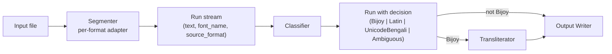
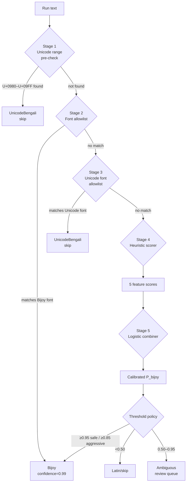

# System Design Document: Cross-Platform ANSI/ASCII Bengali (Bijoy) to Unicode Converter

**Author:** Aniruddha Adhikary  
**Status:** Draft  
**Version:** 0.1.0

---

## 1. System Overview

The converter is a three-layer pipeline: a per-format **Segmenter** that reads input documents and emits a typed stream of `Run` objects, a **Classifier** that scores each run for Bijoy encoding, and a stateless **Transliterator** that rewrites confirmed-Bijoy runs to Unicode Bengali. Only runs classified as Bijoy pass through the transliterator; all other runs pass to the output writer unchanged. This design keeps the core transformation pure and format-agnostic.



---

## 2. Architecture Principles

**Pure-function core.** The transliterator takes a `&str` and returns a `String` with no I/O, no global state, and no side effects. This makes it trivially testable and embeddable in any host language.

**Separable layers.** Segmenter, Classifier, and Transliterator can be compiled, tested, and benchmarked independently. No layer imports from a layer above it.

**Confidence-not-binary classification.** The Classifier returns a calibrated probability, not a boolean. Callers choose their own threshold for auto-conversion vs. review queue. Binary decisions are policy, not mechanism.

**Never destroy input.** The original input file is never modified in place. Every conversion produces a new output file or stream. An audit log records the decision and span map for every run touched.

**Cross-language packaging via Rust + WASM + PyO3.** The transliteration core is written in Rust and compiled to native binaries, WASM, and Python extension modules from a single source. Format-specific adapters live in a Python package (`bijoy-docs`) that imports the core via the wheel. This avoids duplicating the mapping logic across languages.

---

## 3. Component: Segmenter

The Segmenter converts a heterogeneous input document into a flat stream of **`Run`** structs. Each run carries the text content, font metadata if available, format provenance, and a reversible location reference. The Classifier and Transliterator operate only on `Run` values; they never see file formats directly.

```rust
struct Run {
    text: String,
    font_name: Option<String>,
    source_format: SourceFormat,
    location: Location,  // file path + offset/element id for reversibility
}
```

`Location` stores enough information to write the translated text back to the source element (byte offset for plain text, `(paragraph_index, run_index)` for DOCX/PPTX, page + char-index range for PDF).

### 3.1 Plain Text / stdin

Plain-text input produces a single Run with `font_name = None` and `source_format = PlainText`. The Classifier falls through to heuristic scoring because there is no font metadata. Stdin is handled identically: the entire input is buffered as one run.

### 3.2 DOCX

DOCX segmentation walks `w:r` (run) elements via `python-docx`. The font name is read from `w:rFonts/@w:ascii`, **not** `@w:cs` — Bijoy text is stored in the ASCII/ANSI codepoint range and Word marks it as a Latin-script run, never a complex-script run. As [research_detection §6.1](../research_detection.md) confirms, `run.font.name` reads `w:ascii` and is the correct attribute for Bijoy detection.

```python
from docx import Document

WNS = '{http://schemas.openxmlformats.org/wordprocessingml/2006/main}'

def iter_runs_docx(path: str):
    doc = Document(path)
    for para_idx, para in enumerate(doc.paragraphs):
        for run_idx, run in enumerate(para.runs):
            # run.font.name reads w:rFonts/@w:ascii
            font_name = run.font.name
            if font_name is None:
                # Font inherited from paragraph style or docDefaults — resolve cascade
                rpr = run._r.rPr
                if rpr is not None:
                    rfonts = rpr.find(f'{WNS}rFonts')
                    if rfonts is not None:
                        font_name = rfonts.get(f'{WNS}ascii') or rfonts.get(f'{WNS}hAnsi')
            yield Run(
                text=run.text,
                font_name=font_name,
                source_format=SourceFormat.DOCX,
                location=Location(path=path, element_id=(para_idx, run_idx)),
            )
```

If `font_name` is still `None` after the cascade check, the run must be scored heuristically.

### 3.3 PPTX

PPTX uses an identical pattern via `python-pptx`. Each `run.font.name` reads the `<a:latin typeface="...">` attribute of `<a:rPr>`. Font inheritance in PPTX cascades through paragraph default → text frame default → slide layout → slide master → theme; resolve each level if the run-level attribute is absent.

```python
from pptx import Presentation

def iter_runs_pptx(path: str):
    prs = Presentation(path)
    for slide_idx, slide in enumerate(prs.slides):
        for shape in slide.shapes:
            if not shape.has_text_frame:
                continue
            for para_idx, para in enumerate(shape.text_frame.paragraphs):
                for run_idx, run in enumerate(para.runs):
                    yield Run(
                        text=run.text,
                        font_name=run.font.name,  # None if inherited
                        source_format=SourceFormat.PPTX,
                        location=Location(
                            path=path,
                            element_id=(slide_idx, shape.shape_id, para_idx, run_idx),
                        ),
                    )
```

### 3.4 RTF

RTF stores font names in a `{\fonttbl ...}` header group. The segmenter parses the table once at document open to build a `{font_number: font_name}` map, then tracks the active `\fN` control word through the body text stream. Every contiguous span sharing the same font number becomes one Run.

Use [`rtfparse`](https://pypi.org/project/rtfparse/) for production rather than `striprtf`. `striprtf` discards control words before the caller can inspect font assignments, making font tracking impossible. `rtfparse` exposes the token stream and preserves control word order, which is required for correct `\fN` tracking.

### 3.5 HTML/CSS

The HTML segmenter resolves the **effective `font-family`** per text node. The resolution order is: element inline `style` attribute → `<style>` block rules (most specific selector wins) → linked stylesheet rules → browser/user-agent default (irrelevant in a server-side pipeline).

Inline styles are parsed with a regex on `font-family\s*:\s*([^;]+)`. Block and linked stylesheet rules are parsed with `cssutils` or `tinycss2`. The resolved font-family stack is split on commas; the Bijoy font allowlist is tested against each family name in order. For HTML clipboard input, the CF_HTML fragment on Windows and `NSPasteboardTypeHTML` on macOS both preserve inline `style` attributes with font-family values, so the same parser handles clipboard and file inputs.

### 3.6 PDF

PDF segmentation uses `pdfplumber`, which exposes `char['fontname']` at per-character granularity. The **subset prefix** (`ABCDEF+SutonnyMJ`) must be stripped before matching against the font allowlist:

```python
base_name = fontname.split('+')[-1] if '+' in fontname else fontname
```

Characters with the same stripped font name and consecutively adjacent bounding boxes are grouped into runs before being emitted as `Run` objects.

Legacy Bijoy PDFs frequently lack a `ToUnicode` CMap, or carry a CMap that incorrectly maps glyph IDs to Latin codepoints. Do not use `char['text']` as the text content when `fontname` indicates a Bijoy font — use the raw glyph byte values (accessible via `pymupdf` xref stream access) and map them directly through the Bijoy→Unicode table. As [research_detection §6.5](../research_detection.md) documents, `fontname` is the reliable signal; `get_text()` output is unreliable for Bijoy fonts without a correct CMap.

**PDF write-back is out of scope for v1.** Converted output goes to a parallel `.txt` or `.docx` file alongside the source PDF, named `<original>_unicode.docx`. Direct PDF object surgery is deferred to v2 (see §15).

### 3.7 Clipboard

On Windows, the `CF_HTML` clipboard format (registered via `RegisterClipboardFormat("HTML Format")`) stores the clipboard fragment as UTF-8 HTML with inline `style` attributes. Font names survive the copy from Word through CF_HTML. Access via `win32clipboard` and parse with the same HTML/CSS resolver as §3.5.

On macOS, `NSPasteboardTypeHTML` exposes the same HTML-with-styles fragment via PyObjC. Plain-text clipboard formats (`CF_TEXT`, `NSPasteboardTypeString`) strip all font metadata; if only plain text is available, the run is treated like a stdin run and falls through to heuristic scoring.

---

## 4. Component: Classifier

The Classifier is a multi-stage pipeline that returns a structured decision for each `Run`. Every stage can short-circuit the pipeline; later stages run only when earlier stages are inconclusive.

```rust
struct Classification {
    decision: Decision,      // Bijoy | Latin | UnicodeBengali | Ambiguous
    confidence: f32,
    signals: Vec<Signal>,    // ordered list of signals that contributed
}
```



### Stage 1: Unicode Range Pre-check

If any codepoint in the run falls in U+0980–U+09FF (the Bengali Unicode block), the run is already Unicode Bengali. Decision = `UnicodeBengali`, confidence = 1.0, pipeline short-circuits. This prevents re-converting already-converted text.

### Stage 2: Font Allowlist

Case-insensitive substring match against the **Bijoy font list**: all `*MJ`-suffix fonts (SutonnyMJ, AdorshoLipiMJ, JugantorMJ, and 120+ variants documented in [research_converters §5](../research_converters.md)) plus standalone names (SutonnyOMJ, AdorshoLipi, Kalpurush ANSI, Siyam Rupali ANSI, Sulekha family). The `MJ`-suffix heuristic catches undocumented variants without requiring exhaustive enumeration. Decision = `Bijoy`, confidence = 0.99.

### Stage 3: Unicode Font Allowlist

If the font name matches any of: Kalpurush, Nikosh (and NikoshBAN, NikoshGrameen, NikoshLight), SolaimanLipi, Siyam Rupali, Vrinda, Noto Sans Bengali, Noto Serif Bengali, Hind Siliguri — the run is Unicode Bengali. Decision = `UnicodeBengali`, confidence = 0.99. No conversion.

### Stage 4: Heuristic Scorer (Fontless / Unknown Font)

Token-level scoring on five features, each normalized to \([0, 1]\):

- **High-byte density** — fraction of characters in Windows-1252 0x80–0xFF. Bijoy Bengali regularly reaches 0.15–0.35 (e-kar `†` alone appears in ~40% of syllables per [research_detection §2.2](../research_detection.md)); English prose is below 0.01.
- **Bijoy-distinctive char count** — presence of `† ‡ • ‰ Š ‹ Œ — ¯ ¦ § © ª « ¬` as a fraction of run length. These are Bengali vowel signs and conjunct markers; they appear in isolation or followed by digits in English, but mid-word followed by letters in Bijoy.
- **Bijoy bigram score** — raw count of high-signal bigrams: `Kv`, `Ki`, `Ges`, `†K`, `†h`, `†m`, `†f`, `ev`, `Av`. A run with 3+ of these is near-certain Bijoy per [research_detection §2.3](../research_detection.md).
- **English dictionary coverage** — fraction of tokens (length ≥ 3) found in the `wordfreq` top-50k English list. English prose scores 0.75–0.95; Bijoy prose scores <0.05 because tokenized Bijoy sequences like `evsjvq`, `Zviv` are not English words.
- **Char 4-gram model probability** — \(P(\text{bijoy} \mid \text{text})\) from a small logistic regression or trained 4-gram LM fit on a labeled corpus. This captures distributional patterns not covered by the lexical features above.

### Stage 5: Combiner

Logistic regression over the five Stage 4 features, trained on a labeled corpus of Bijoy, English, and mixed runs. Training data sourced from Bangladeshi newspaper archives (Prothom Alo, Daily Star) for Bijoy, and the Brown corpus + Wikipedia for English. The model outputs a calibrated probability; [Platt scaling](https://en.wikipedia.org/wiki/Platt_scaling) applied post-training.

### Threshold Policy

| Mode | Convert threshold | Skip threshold | Between |
|---|---|---|---|
| Safe | ≥ 0.95 | < 0.50 | Ambiguous → review queue |
| Aggressive | ≥ 0.85 | < 0.50 | Ambiguous → review queue |

Runs below 0.50 are labeled `Latin` and passed through unconverted. Runs in the Ambiguous band are emitted to a structured review log with all five signal scores attached.

---

## 5. Component: Transliterator

The transliterator is a **stateless pure function**:

```rust
pub fn transliterate(bijoy_text: &str) -> (String, SpanMap) {
    // SpanMap = Vec<(original_byte_range, unicode_byte_range)>
}
```

No I/O. No allocator beyond the output string and span map. Safe to call from any thread.

### 5.1 Mapping Tables

A single canonical **TOML file** (see §6) is the source of truth for all character mappings. It is compiled at build time into an Aho-Corasick automaton for O(n) longest-match replacement (see §10). The license source is [avro.py (MIT)](https://github.com/hitblast/avro.py), which carries the cleanest license among existing implementations; the Mad-FOX `bijoy2unicode` mapping (MPL-2.0) is used for cross-validation only.

Example TOML entries:

```toml
[quadgrams]
"†Kvi" = "কের"     # e-kar + ka + aa-kar + ra
"†Kvb" = "কের"     # variant

[trigrams]
"†Ki" = "কে"       # e-kar + ka + ra-form

[bigrams]
"Kv" = "কা"        # ka + aa-kar
"†K" = "কে"        # e-kar + ka
"©K" = "র্ক"       # reph (0xA9) + ka

[single_char]
"K" = "ক"          # ka
"v" = "া"          # aa-kar
"†" = "ে"          # e-kar (standalone, after longer-match fails)
"©" = "র্"         # reph
"|" = "।"          # dari
```

### 5.2 Multi-Pass Pipeline

Passes execute in this exact order. Order is non-negotiable: later passes depend on the output of earlier ones.

1. **Pre-normalize** — strip soft hyphens (U+00AD), normalize NBSP (U+00A0 → U+0020), strip Windows line endings to LF.
2. **4-char ligature replacements** — apply all `quadgrams` entries, longest match first via Aho-Corasick.
3. **3-char ligature replacements** — `trigrams`.
4. **2-char replacements** — `bigrams`.
5. **1-char replacements** — `single_char`.
6. **Reph reordering** — detect `র্` prefix patterns and move to after the next consonant cluster (visual→logical). See pseudocode below.
7. **i-kar / ii-kar position swap** — Bijoy stores `ি` (U+09BF) and `ী` (U+09C0) after the consonant in byte order because the glyph appears to the right visually; Unicode requires the logical post-consonant order. After step 5 these signs may have been placed at incorrect positions; this pass corrects them by scanning for `<vowel_sign><consonant>` sequences and swapping.
8. **e-kar / o-kar split-glyph recombination** — `ে` (U+09C7) + `া` (U+09BE) → `ো` (U+09CB); `ে` + `ৗ` (U+09D7) → `ৌ` (U+09CC). This must run after all char substitutions so both halves of the split glyph are already in Unicode.
9. **ya-phala normalization** — insert ZWJ (U+200D) in `র্য` sequences to force ya-phala rendering rather than reph-over-ya. As [research_converters §3.4](../research_converters.md) notes, the `র্য` sequence (as in র্যাব) requires `Ra + ZWJ + Hasanta + Ya`; without ZWJ, HarfBuzz-based renderers may misplace the reph.
10. **Nukta letter normalization** — replace `ড` + `়` (U+09A1 + U+09BC) → `ড়` (U+09DC); `ঢ` + `়` → `ঢ়` (U+09DD); `য` + `়` → `য়` (U+09DF). Prefer precomposed atomic forms to avoid the `BrokenNukta` failure mode documented in [bnUnicodeNormalizer](https://github.com/mnansary/bnUnicodeNormalizer).
11. **NFC normalization** — `unicode_normalization::UnicodeNormalization::nfc()` on the output string.

### 5.3 Reph Reordering — Pseudocode

Reph reordering is the most bug-prone pass per [research_converters §3.3](../research_converters.md). The core rule: after char substitution, a `র্` sequence appearing before a consonant cluster was placed there by the Bijoy visual encoding; in Unicode it belongs after the first consonant of the cluster.

```
function reorder_reph(text: [Unicode codepoint]):
    output = []
    i = 0
    while i < len(text):
        if text[i] == 'র' and text[i+1] == '্':
            # Potential reph; collect the following consonant cluster
            reph_start = i
            i += 2  # skip র্
            # Consume hasanta + consonant pairs (conjunct consonants)
            cluster_start = i
            while i < len(text) and is_consonant(text[i]):
                i += 1
                if i < len(text) and text[i] == '্':
                    i += 1  # consume hasanta, continue to next consonant
                else:
                    break
            cluster = text[cluster_start:i]
            if len(cluster) > 0:
                # Emit cluster first, then reph after first consonant
                output.append(cluster[0])
                output.append('র')
                output.append('্')
                output.extend(cluster[1:])
            else:
                # No following consonant — emit রH as-is (explicit virama)
                output.append('র')
                output.append('্')
        else:
            output.append(text[i])
            i += 1
    return output
```

Edge cases: reph before a ya-phala cluster (`র্য`), reph before a multi-consonant conjunct, and reph at the end of a word (explicit virama, no reorder). Each edge case requires a dedicated test case (see §11).

### 5.4 Reversibility

The transliterator emits a `SpanMap` alongside the converted string. Each entry maps an original byte range in the Bijoy input to a byte range in the Unicode output. This span map is written to the audit log on every invocation and is the mechanism for `--explain` output (§12).

---

## 6. Mapping Table Format

The canonical mapping table is a single TOML file, versioned and hashable.

```toml
version = "1.0.0"
direction = "bijoy_to_unicode"
sha256 = "e3b0c44298fc1c149afb..."  # hash of the entries below, not including this field

[single_char]
"K" = "ক"
"L" = "খ"
"M" = "গ"
"v" = "া"
"w" = "ি"
"x" = "ী"
"†" = "ে"
"©" = "র্"
"|" = "।"
# ... ~150 entries total

[bigrams]
"Kv" = "কা"
"†K" = "কে"
"Av" = "আ"
"ev" = "বা"

[trigrams]
"†Ki" = "কের"
"Ges" = "এবং"

[quadgrams]
"†Kiv" = "কেরা"

[post_passes]
# Named passes applied after character substitution; order is significant
passes = [
    "reph_reorder",
    "ikar_swap",
    "ekar_recombine",
    "ya_phala_zwj",
    "nukta_normalize",
    "nfc",
]
```

The file is distributed as a single artifact embedded in the Rust crate via `include_str!`. Downstream tools can pin to a specific `sha256` to guarantee reproducible conversions. The `version` field follows semver; any change to character entries bumps the minor version; breaking changes bump major.

---

## 7. Cross-Language Packaging

The Rust crate `bijoy-core` contains the Transliterator, the Aho-Corasick automaton builder, the mapping table parser, and the Classifier's statistical features. All format-specific code lives in the Python package `bijoy-docs`.

### Bindings

- **CLI** (`bijoy` binary) — compiled with `clap`. Static binary per platform (musl libc on Linux). Supports `--safe`/`--aggressive` mode flags, `--audit` for span logs, `--explain` for per-token reasoning.
- **Python wheel** — `PyO3` + `maturin`. Exposes `bijoy_core.transliterate(text: str) -> str` and `bijoy_core.classify(text: str, font_name: str | None) -> Classification`.
- **WASM** — `wasm-bindgen` + `wasm-pack`. Produces `bijoy_core.js` + `bijoy_core_bg.wasm`. Consumed by the npm package.
- **npm package** — TypeScript types generated from `wasm-bindgen`. Published to npmjs.com as `@aniruddha/bijoy-core`.
- **Mobile** — `UniFFI` generates Swift bindings (XCFramework) and Kotlin bindings (AAR) for iOS and Android embedding.

### CI Matrix

| Platform | Artifact | Release target |
|---|---|---|
| `ubuntu-latest` + musl | `bijoy-linux-x86_64` (static) | GitHub Releases |
| `ubuntu-latest` + manylinux2014 | `bijoy_core-*.whl` (Linux x86_64) | PyPI |
| `ubuntu-latest` + manylinux2014 aarch64 | `bijoy_core-*.whl` (Linux aarch64) | PyPI |
| `macos-13` (x86_64) | `bijoy_core-*.whl` (macOS x86_64) | PyPI |
| `macos-14` (arm64) | `bijoy_core-*.whl` (macOS arm64) | PyPI |
| `windows-latest` | `bijoy_core-*.whl` (Windows amd64) | PyPI |
| `windows-latest` | `bijoy-windows-x86_64.exe` | GitHub Releases |
| `ubuntu-latest` | `bijoy_core_bg.wasm` + `bijoy_core.js` | npm |
| `macos-14` | Swift XCFramework | GitHub Releases |
| `ubuntu-latest` | Kotlin AAR | GitHub Packages |

`bijoy-docs` (Python, format adapters) is published to PyPI as a pure-Python wheel with `bijoy-core` declared as a runtime dependency. Installing `bijoy-docs` pulls the correct platform wheel for `bijoy-core` automatically via pip's tag matching.

---

## 8. Data Flow Examples

### 8.1 DOCX with Mixed Runs

A paragraph with three runs: text in SutonnyMJ, a second paragraph in Kalpurush (Unicode), and a third paragraph in Arial.

1. Segmenter emits Run 1: `{text: "Avwg evsjvq...", font_name: "SutonnyMJ", ...}`.
2. Classifier Stage 2 matches `SutonnyMJ` against the Bijoy font allowlist → `Bijoy`, confidence 0.99.
3. Transliterator processes Run 1, emits `"আমি বাংলায়..."` and a span map.
4. Segmenter emits Run 2: `{text: "আমি বাংলায়...", font_name: "Kalpurush", ...}`.
5. Classifier Stage 1 finds U+0980–U+09FF codepoints → `UnicodeBengali`, skip.
6. Segmenter emits Run 3: `{text: "Figure 1: GDP Growth", font_name: "Arial", ...}`.
7. Classifier Stage 2 finds no match; Stage 3 finds no match; Stage 4 heuristic scorer returns high English coverage, low high-byte density → Stage 5 outputs P(bijoy) ≈ 0.01 → `Latin`, skip.
8. Output writer reassembles the DOCX: Run 1 replaced with translated Unicode text, Run 2 and Run 3 unchanged.

### 8.2 Plain-Text Bijoy File with English Caption Lines

Input: a `.txt` file with 30 lines of Bijoy-encoded news text and three English caption lines interspersed.

1. Segmenter emits one Run per newline-delimited paragraph.
2. Classifier has no font metadata for any run; all proceed to Stage 4.
3. Bijoy body lines: high-byte density ~0.20, Bijoy bigram hits 5–10, English dictionary coverage ~0.03 → P(bijoy) ≈ 0.97 → `Bijoy` (safe mode threshold met).
4. English caption lines ("Figure 1: GDP Growth 2023", "Source: World Bank"): high-byte density ~0.00, Bijoy bigram hits 0, English coverage ~0.85 → P(bijoy) ≈ 0.02 → `Latin`, preserved verbatim.
5. Output: `.txt` file with Bijoy body in Unicode, English captions unchanged.

### 8.3 PDF with Embedded SutonnyMJ Subset Font

Input: a two-page PDF produced by Microsoft Word, font embedded as `ABCDEF+SutonnyMJ`.

1. Segmenter uses pdfplumber; reads `char['fontname']` = `"ABCDEF+SutonnyMJ"`.
2. Prefix strip: `base_name = "SutonnyMJ"`.
3. Consecutive characters with same `base_name` and adjacent bounding boxes are merged into runs.
4. Classifier Stage 2: `"SutonnyMJ"` matches Bijoy allowlist → `Bijoy`, confidence 0.99.
5. Raw glyph bytes are extracted (not `char['text']`, which may be garbled due to missing ToUnicode CMap) and passed to the transliterator.
6. Output: `input_unicode.docx` written alongside the source PDF. The PDF is not modified.

---

## 9. Storage and State

The system is stateless. Mapping tables and ML model weights (the logistic regression coefficients for Stage 5) are embedded as static resources at build time via `include_str!` and `include_bytes!` in Rust. There is no database, no network connection, and no persistent session state.

Optional **audit logs** are written to disk per invocation when `--audit` is passed. Each log is a newline-delimited JSON file at the path `<output_dir>/<input_stem>_audit.jsonl`. Each line records one `Run`: input byte range, classification decision, confidence, signals, and output byte range. Logs are append-only and never read back by the converter itself.

---

## 10. Performance Considerations

**Aho-Corasick automaton.** At startup (or build time for the CLI), the mapping tables are compiled into an Aho-Corasick automaton using the [`aho-corasick` Rust crate](https://docs.rs/aho-corasick). This gives O(n) longest-match replacement with no backtracking. A naive trie scan would also be O(n) in the best case but with a larger constant; Aho-Corasick is preferred because the crate is battle-tested and handles overlapping matches correctly.

**Throughput targets.** Plain text: 50 MB/s on a single core (Rust transliterator). DOCX: 5 pages/sec including python-docx XML parsing overhead. These are conservative targets achievable on a 2019-era laptop; document parsing is the bottleneck, not the Rust core.

**Memory model.** The Segmenter streams document elements; it does not load the entire document into memory. Memory footprint is O(run-size), not O(document-size). For DOCX, this means `python-docx` is called once, but runs are emitted lazily. For PDF, pages are processed one at a time via the `pdfplumber` page iterator.

**Classifier short-circuits.** Stages 1–3 are O(1) per run (hash lookups and a single Unicode range check). Stage 4 runs only for fontless or unknown-font runs, which are a minority in well-formatted DOCX/PPTX inputs from professional publishing workflows.

---

## 11. Testing Strategy

**Unit tests on the transliterator.** Corpus of (Bijoy, Unicode) pairs sourced from public Bangladeshi news archives (Prothom Alo, Daily Star via Common Crawl). Tests assert byte-exact Unicode output for each Bijoy input.

**Property test: round-trip.** `bijoy → unicode → bijoy` must preserve byte equality on the conversion-safe subset (runs with no ambiguous mixed-script tokens). Implemented with `proptest` in Rust. The conversion-safe subset is defined as runs where the classifier returns `Bijoy` with confidence ≥ 0.95.

**Differential test.** Compare output of `bijoy-core` against [avro.py](https://github.com/hitblast/avro.py) and [Mad-FOX bijoy2unicode](https://github.com/Mad-FOX/bijoy2unicode) on a shared 10k-sentence corpus. Differences are reviewed manually and resolved in the mapping table, not by patching test expectations.

**English-safety test.** 100k tokens from the Brown corpus + 100k tokens from Wikipedia English must not be converted (false-positive rate < 0.5%). Run against the full classifier pipeline in safe mode (threshold 0.95). This is the primary guard against the core failure mode described in [research_converters §4.1](../research_converters.md).

**Format-fidelity test.** DOCX round-trip: input DOCX → convert → output DOCX. All non-Bijoy formatting (tables, images, embedded objects, paragraph styles, numbering lists) must survive intact. Verified by `unzip`-diffing the `word/document.xml` of input and output, expecting changes only in Bijoy-classified run text nodes.

**Ligature edge-case test files.** Six dedicated test files, one per known failure mode:
- Reph reordering (including reph before multi-consonant conjunct)
- Ya-phala with ZWJ (`র্য` in র্যাব)
- i-kar position swap in conjunct context
- Split-glyph o-kar and ou-kar recombination
- Nukta letter normalization (`ড়`, `ঢ়`, `য়`)
- Chandrabindu placement inside conjuncts

---

## 12. Observability

Every invocation emits a **structured JSON log** to stderr (or to `--log-file` if specified):

```json
{
  "input_path": "article.docx",
  "input_bytes": 204800,
  "runs_total": 147,
  "runs_bijoy": 98,
  "runs_latin": 42,
  "runs_unicode_bengali": 7,
  "runs_ambiguous": 0,
  "output_bytes": 201344,
  "duration_ms": 312,
  "classifier_mode": "safe"
}
```

The optional `--explain` flag dumps per-run classifier reasoning to the same log. Each run entry includes the five Stage 4 feature scores, the Stage 5 probability, and the final decision.

For integration into existing log pipelines, all log lines are valid JSON and written one object per line (JSONL). No log line exceeds 4 KB.

---

## 13. Security and Privacy

No network. The converter makes no outbound connections at any time. Mapping tables and ML weights are compiled into the binary.

No telemetry. No usage data is collected or transmitted.

No persistent storage of user content. Input documents are read once, output is written once. No intermediate files outside the audit log (which is written only when `--audit` is explicitly passed).

Mapping tables are static and cannot be modified at runtime. There is no plugin system or dynamic code loading. The attack surface is: input file parsing (managed by `python-docx`, `pdfplumber`, etc.) and the Rust transliterator (which is a pure string transformation with no memory unsafety in safe Rust).

---

## 14. Migration and Rollout

**Beta partners (three):**
- A Bangladeshi daily newspaper (bulk DOCX archive conversion; primary test for format fidelity and reph bugs)
- A university computational linguistics lab (NLP pipeline integration via Python wheel; primary test for the classifier false-positive rate on mixed Bengali/English academic text)
- A developer building a Bengali NLP package (API stability and PyPI packaging; primary test for programmatic use)

**Feature flag: aggressive mode.** Aggressive classification (threshold 0.85) is behind a `--aggressive` flag, disabled by default. Beta partners who opt in report statistics; aggressive mode becomes default when the false-positive rate on their corpora drops below 0.5%.

**Version milestones:**

| Version | Scope |
|---|---|
| v0.1.0 | Plain text + DOCX; safe mode only; CLI + Python wheel |
| v0.2.0 | RTF + PPTX |
| v0.3.0 | PDF (read-only, parallel output) + HTML |
| v0.4.0 | Clipboard; aggressive mode flag |
| v1.0.0 | All formats + WASM + npm package + mobile bindings; aggressive mode default-on after corpus validation |

---

## 15. Open Technical Questions

**PDF write-back.** Injecting Unicode Bengali text back into an existing PDF requires either (a) `reportlab`-based PDF regeneration (loses original layout fidelity) or (b) direct PDF object surgery to replace the text stream and update the ToUnicode CMap. Option (b) preserves layout but is fragile against unusual PDF structures. Decision deferred to v2; scope for v1 is parallel-file output only.

**N-gram model placement.** The Stage 5 logistic regression classifier can live in Rust (compiled as a weight array with `ndarray`) or can be precomputed Python-side. Rust placement keeps the full classifier in `bijoy-core` and makes it available to CLI, WASM, and mobile; Python placement simplifies training iteration but requires a bridge for the Rust CLI. Current lean: bake trained weights as a `const` array in Rust, retrain and embed via `build.rs`.

**Longest-match data structure.** Aho-Corasick (current plan) handles arbitrary-length patterns efficiently but allocates per-pattern state. A hand-rolled trie with path compression could be faster in cache for the small (~200-entry) mapping table. Benchmark both on 10 MB representative input before final choice.

---

## 16. Appendix: References

- **research_converters.md** — [Research: Bengali ANSI/ASCII Converter Landscape](./research_converters.md) — Bijoy encoding details, existing tools, character mapping tables, ligature handling, common bugs, and font families.
- **research_detection.md** — [Research: Detection Heuristics for Bijoy vs. Latin Text](./research_detection.md) — Statistical LID library comparison, Bijoy-specific signals, English dictionary approach, mixed-script handling, confidence thresholds, and per-format font extraction.
- [avro.py (MIT)](https://github.com/hitblast/avro.py) — Primary license-clean mapping table source.
- [Mad-FOX/bijoy2unicode (MPL-2.0)](https://github.com/Mad-FOX/bijoy2unicode) — Cross-validation reference.
- [bahar/BijoyToUnicode (AGPL-3.0)](https://github.com/bahar/BijoyToUnicode) — PHP reference implementation; character mapping table used for Stage 4 distinctive-char list.
- [mnansary/bnUnicodeNormalizer (MIT)](https://github.com/mnansary/bnUnicodeNormalizer) — Post-conversion normalization reference; documents real-world nukta and hosanta failure modes.
- [Unicode L2/2003/03233 — Bengali](https://www.unicode.org/L2/L2003/03233-bengali.pdf) — Authoritative reference for reph, ya-phala, and hasanta encoding rules.
- [W3C IIP issue #14](https://github.com/w3c/iip/issues/14) — ZWJ vs. ZWNJ in `র্য` sequences.
- [Bangla Type Foundry — Reph in InDesign](https://banglatypefoundry.com/reph-in-indesign/) — Documents reph rendering bugs in production workflows.
- [python-docx font analysis](https://python-docx.readthedocs.io/en/latest/dev/analysis/features/text/font.html) — Authoritative source for `w:rFonts/@w:ascii` vs. `@w:cs`.
- [pdfplumber (PyPI)](https://pypi.org/project/pdfplumber/) — PDF character-level font name extraction.
- [rtfparse (PyPI)](https://pypi.org/project/rtfparse/) — Production RTF parser with control-word token access.
- [wordfreq (PyPI)](https://pypi.org/project/wordfreq/) — English top-50k word frequency list for Stage 4 dictionary coverage feature.
- [aho-corasick Rust crate](https://docs.rs/aho-corasick) — O(n) longest-match automaton used for mapping table compilation.
- [omicronlab Bangla Fonts](https://www.omicronlab.com/bangla-fonts.html) — Kalpurush, Siyam Rupali, Nikosh Unicode font list.
- [HindiTyping — Bijoy fonts list](https://hindityping.info/download/bangla-fonts-bijoy) — Exhaustive MJ-suffix font enumeration for the Stage 2 allowlist.
